# 🗺️ NeuroQuantumDB - Visual Task Dependencies

## Dependency Graph (Mermaid)

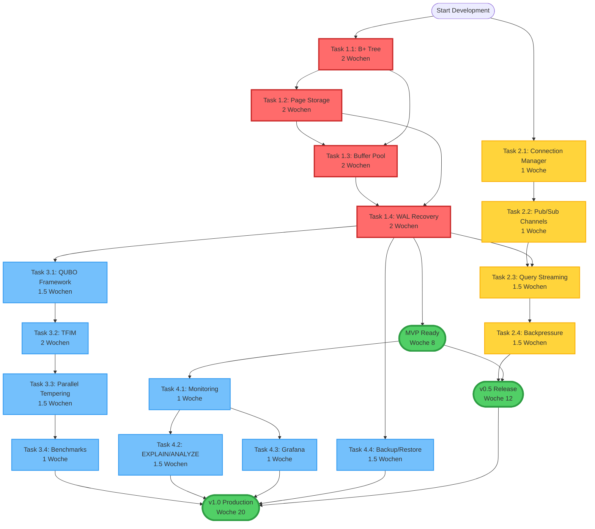

---

## Critical Path Analysis

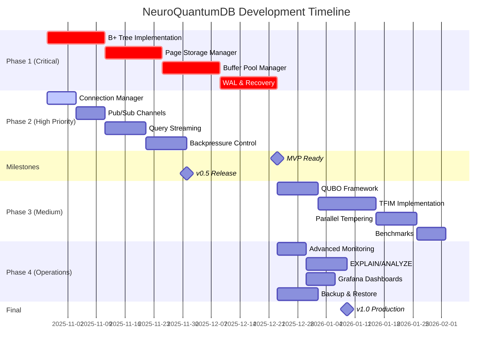

---

## Module Dependency Tree

```mermaid
graph LR
    subgraph "neuroquantum-core"
        Core[lib.rs]
        
        Storage[storage.rs]
        BTree[btree/]
        Pager[pager/]
        Buffer[buffer/]
        WAL[wal/]
        
        Quantum[quantum.rs]
        QUBO[quantum/qubo.rs]
        TFIM[quantum/tfim.rs]
        
        Learning[learning.rs]
        Synaptic[synaptic.rs]
        Plasticity[plasticity.rs]
        
        DNA[dna.rs]
        NEON[neon_optimization.rs]
    end
    
    subgraph "neuroquantum-api"
        API[lib.rs]
        Handlers[handlers.rs]
        Auth[auth.rs]
        WS[websocket/]
        WSManager[websocket/manager.rs]
        WSChannels[websocket/channels.rs]
        WSStream[websocket/streaming.rs]
    end
    
    subgraph "neuroquantum-qsql"
        QSQL[lib.rs]
        Parser[parser.rs]
        Executor[executor.rs]
        Optimizer[optimizer.rs]
        NLP[natural_language.rs]
    end
    
    %% Core Dependencies
    Core --> Storage
    Storage --> BTree
    Storage --> Pager
    Storage --> Buffer
    Storage --> WAL
    
    Core --> Quantum
    Quantum --> QUBO
    Quantum --> TFIM
    
    Core --> Learning
    Learning --> Synaptic
    Learning --> Plasticity
    
    Core --> DNA
    DNA --> NEON
    
    %% API Dependencies
    API --> Core
    API --> QSQL
    Handlers --> Auth
    Handlers --> WS
    WS --> WSManager
    WS --> WSChannels
    WS --> WSStream
    
    %% QSQL Dependencies
    QSQL --> Core
    Parser --> Executor
    Executor --> Optimizer
    Parser --> NLP
    
    %% Task Dependencies
    BTree -.Task 1.1.-> Pager
    Pager -.Task 1.2.-> Buffer
    Buffer -.Task 1.3.-> WAL
    WAL -.Task 1.4.-> Complete1[Phase 1 Complete]
    
    WSManager -.Task 2.1.-> WSChannels
    WSChannels -.Task 2.2.-> WSStream
    WSStream -.Task 2.3.-> Complete2[Phase 2 Complete]
    
    QUBO -.Task 3.1.-> TFIM
    
    classDef coreModule fill:#e3f2fd,stroke:#1976d2
    classDef apiModule fill:#f3e5f5,stroke:#7b1fa2
    classDef qsqlModule fill:#e8f5e9,stroke:#388e3c
    classDef taskModule fill:#fff3e0,stroke:#f57c00
    
    class Core,Storage,BTree,Pager,Buffer,WAL,Quantum,QUBO,TFIM,Learning,Synaptic,Plasticity,DNA,NEON coreModule
    class API,Handlers,Auth,WS,WSManager,WSChannels,WSStream apiModule
    class QSQL,Parser,Executor,Optimizer,NLP qsqlModule
    class Complete1,Complete2 taskModule
```

---

## Resource Allocation Matrix

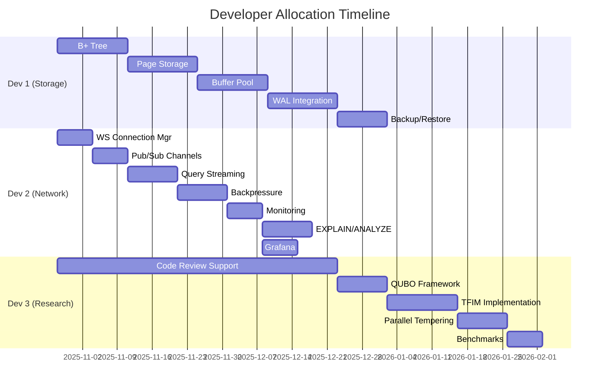

---

## Testing Strategy

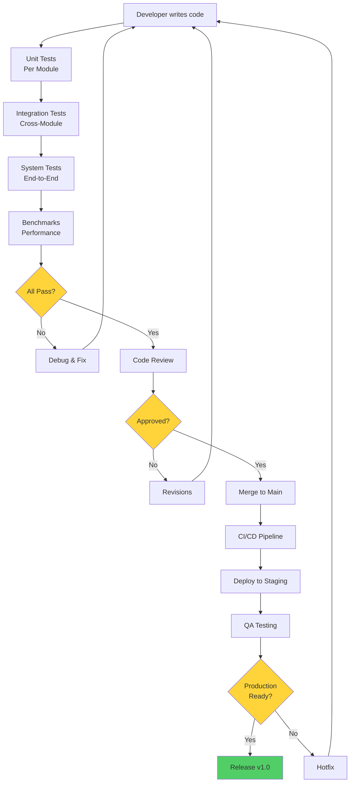

---

## Risk Heat Map

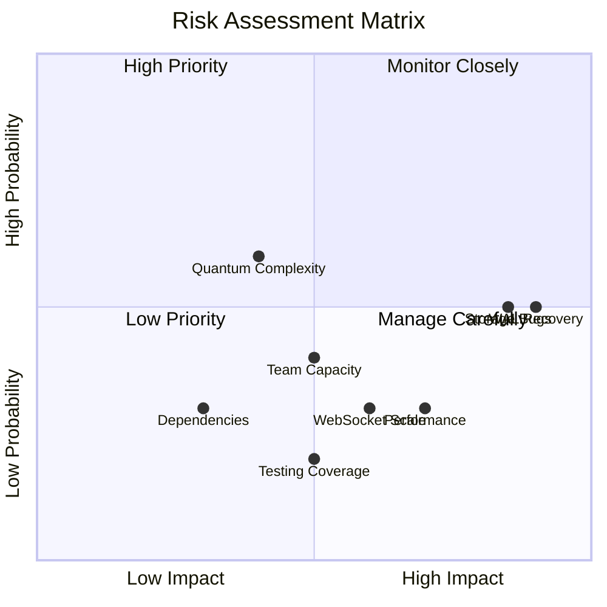

---

## Feature Completion Progress

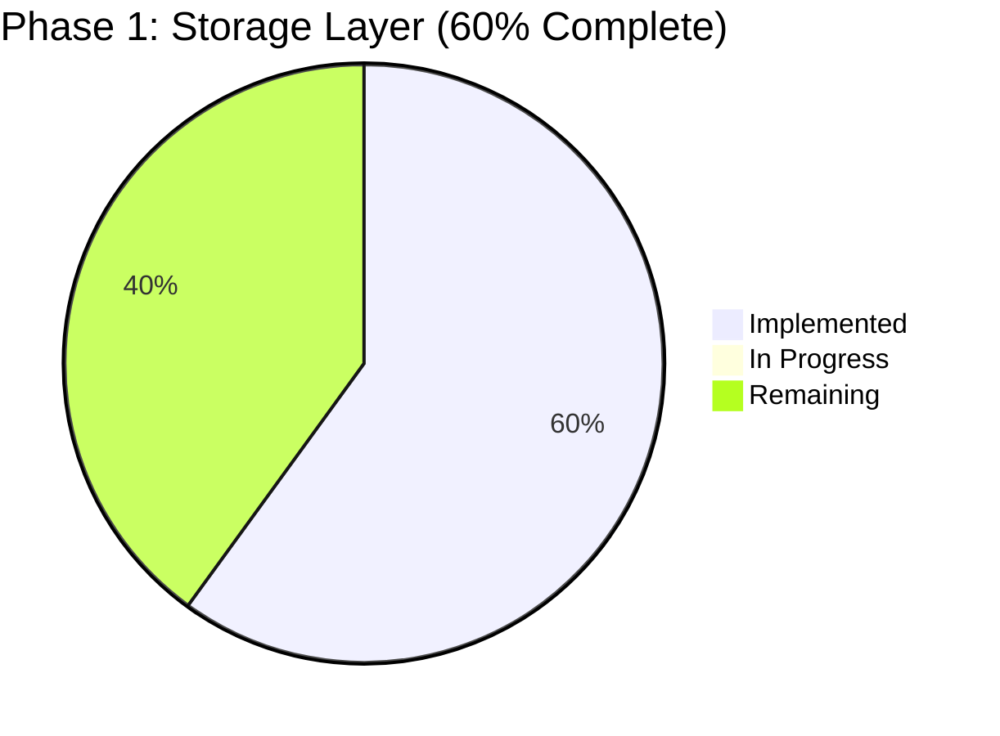

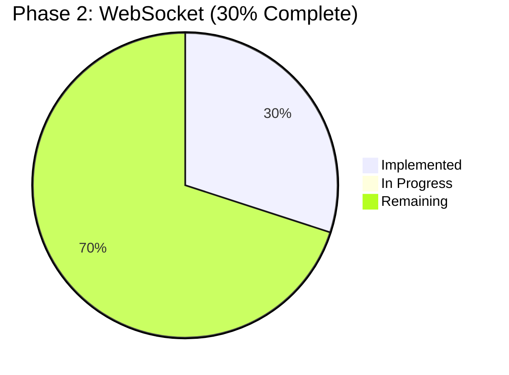

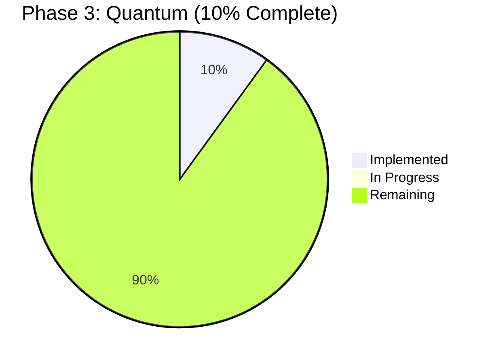

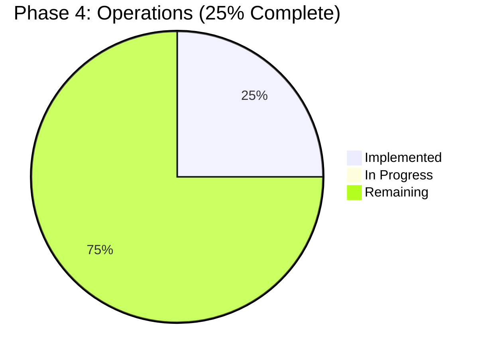

---

## Architecture Layers

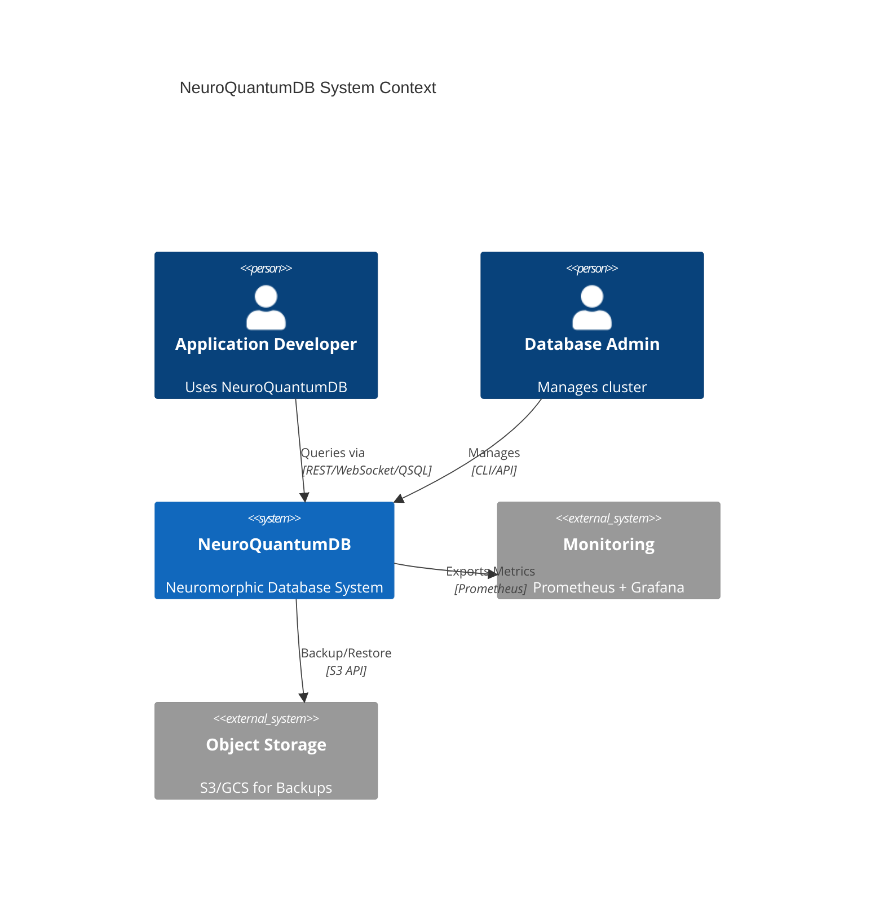

---

## Technology Stack

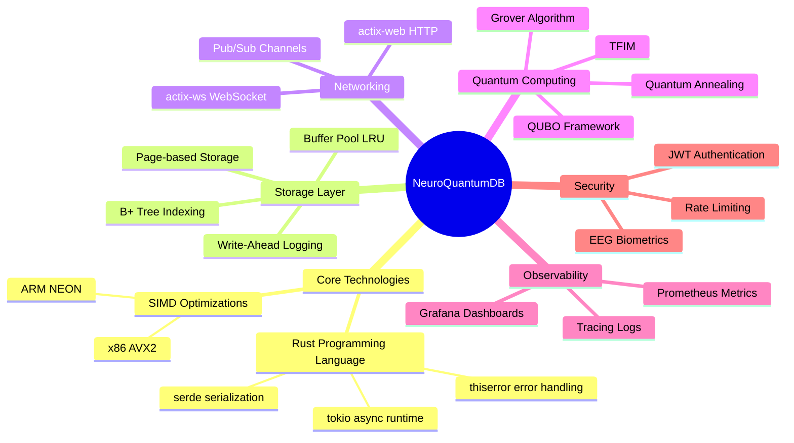

---

## Performance Targets

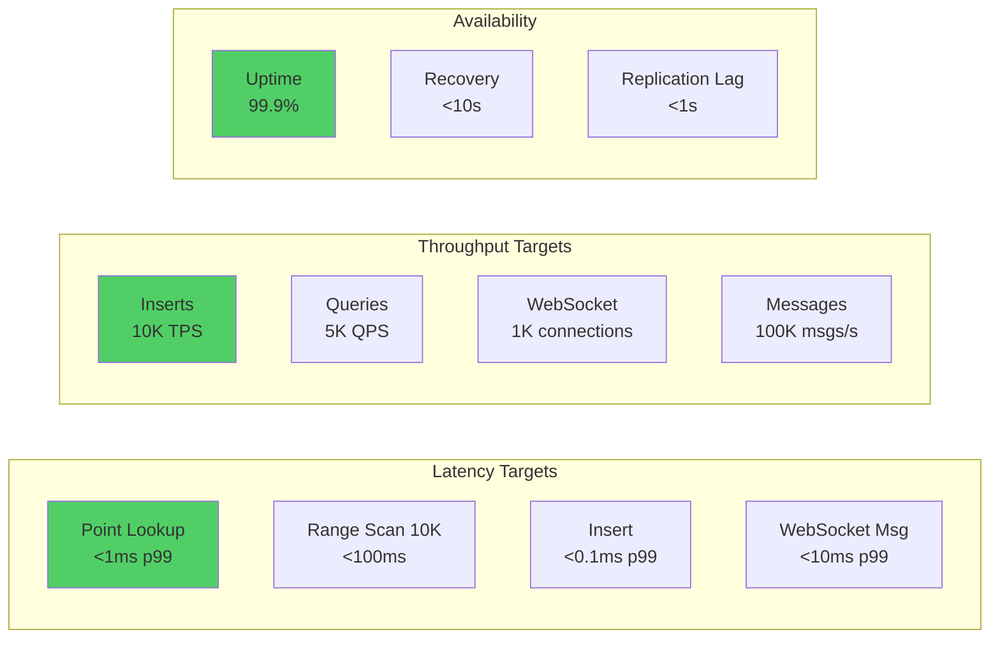

---

**Diagramme erstellt:** 28. Oktober 2025  
**Tool:** Mermaid.js v10+  
**Render:** GitHub/GitLab/mdBook kompatibel

