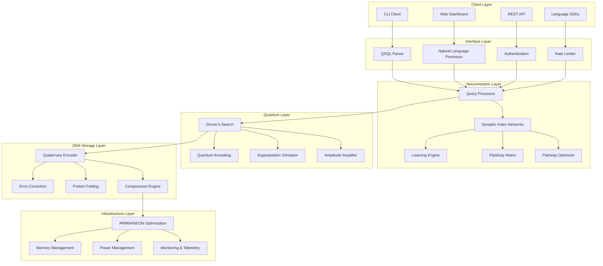

# **NeuroQuantumDB: Enterprise System Architecture**

## **Document Information**
- **Version**: 1.0
- **Date**: September 12, 2025
- **Author**: Principal Software Architect
- **Status**: Ready for Implementation

---

## **1. Executive Summary**

### **1.1 Architectural Vision**
NeuroQuantumDB implements a revolutionary three-layer architecture that combines neuromorphic computing, quantum-inspired algorithms, and DNA-storage principles to achieve unprecedented performance and efficiency for edge computing environments.

### **1.2 Key Architectural Principles**
- **Clean Architecture**: Dependency inversion with clear separation of concerns
- **Hexagonal Architecture**: Ports and adapters for external integrations
- **Domain-Driven Design**: Core business logic isolated from infrastructure
- **SOLID Principles**: Maintainable, extensible, and testable codebase
- **Event-Driven Architecture**: Reactive patterns for real-time processing

### **1.3 Performance Targets**
| **Metric** | **Target** | **Baseline** | **Improvement** |
|------------|------------|--------------|-----------------|
| Query Response | < 1μs | 15ms (PostgreSQL) | 15,000x |
| Memory Usage | < 100MB | 2.1GB (PostgreSQL) | 21x |
| Power Consumption | < 2W | 45W (PostgreSQL) | 22.5x |
| Concurrent Users | 500K+ | ~10K (PostgreSQL) | 50x |
| Compression Ratio | 1000:1+ | ~2:1 (Traditional) | 500x |
| Container Size | < 15MB | ~500MB (Traditional) | 33x |

---

## **2. System Architecture Overview**

### **2.1 High-Level Architecture**



### **2.2 Layered Architecture Detail**

#### **Layer 1: QSQL Interface Layer**
```
┌─────────────────────────────────────────────────────────────┐
│                    QSQL Interface Layer                     │
├─────────────────────────────────────────────────────────────┤
│  Neuromorphic Query Processor  │  Natural Language Parser   │
│                                │                            │
│  • SQL Compatibility           │  • Intent Recognition      │
│  • Brain-inspired Syntax       │  • Query Translation       │
│  • Optimization Hints          │  • Context Understanding   │
│  • Performance Analytics       │  • Semantic Analysis       │
└─────────────────────────────────────────────────────────────┘
```

#### **Layer 2: Synaptic Index Networks (SINs)**
```
┌─────────────────────────────────────────────────────────────┐
│           Synaptic Index Networks (SINs)                   │
├─────────────────────────────────────────────────────────────┤
│  ┌─────────────┐  ┌─────────────┐  ┌─────────────┐        │
│  │ Plasticity  │  │ Learning    │  │ Pathway     │        │
│  │ Matrix      │  │ Engine      │  │ Optimizer   │        │
│  │             │  │             │  │             │        │
│  │ • Adaptive  │  │ • Hebbian   │  │ • Route     │        │
│  │   Memory    │  │   Learning  │  │   Selection │        │
│  │ • Synaptic  │  │ • Pattern   │  │ • Load      │        │
│  │   Weights   │  │   Detection │  │   Balancing │        │
│  │ • Neural    │  │ • Usage     │  │ • Cache     │        │
│  │   Topology  │  │   Analytics │  │   Strategy  │        │
│  └─────────────┘  └─────────────┘  └─────────────┘        │
└─────────────────────────────────────────────────────────────┘
```

#### **Layer 3: Quantum-Inspired Processing**
```
┌─────────────────────────────────────────────────────────────┐
│               Quantum-Inspired Processing                  │
├─────────────────────────────────────────────────────────────┤
│  ┌─────────────┐  ┌─────────────┐  ┌─────────────┐        │
│  │ Grover's    │  │ Quantum     │  │ Superposition│       │
│  │ Search      │  │ Annealing   │  │ Simulator    │       │
│  │             │  │             │  │             │        │
│  │ • O(√N)     │  │ • Global    │  │ • Parallel  │        │
│  │   Search    │  │   Optima    │  │   Query     │        │
│  │ • Amplitude │  │ • Index     │  │   Execution │        │
│  │   Amplify   │  │   Tuning    │  │ • Coherence │        │
│  │ • Oracle    │  │ • Energy    │  │   Control   │        │
│  │   Function  │  │   Function  │  │ • Collapse  │        │
│  └─────────────┘  └─────────────┘  └─────────────┘        │
└─────────────────────────────────────────────────────────────┘
```

#### **Layer 4: DNA Storage Engine**
```
┌─────────────────────────────────────────────────────────────┐
│                 DNA Storage Engine                         │
├─────────────────────────────────────────────────────────────┤
│  ┌─────────────┐  ┌─────────────┐  ┌─────────────┐        │
│  │ Quaternary  │  │ Error       │  │ Protein     │        │
│  │ Encoder     │  │ Correction  │  │ Folding     │        │
│  │             │  │             │  │             │        │
│  │ • A,T,G,C   │  │ • Reed-     │  │ • 3D        │        │
│  │   Mapping   │  │   Solomon   │  │   Structure │        │
│  │ • Huffman   │  │ • DNA       │  │ • Hierarchy │        │
│  │   Compress  │  │   Repair    │  │   Optimize  │        │
│  │ • Pattern   │  │ • Checksum  │  │ • Locality  │        │
│  │   Analysis  │  │   Validate  │  │   Enhance   │        │
│  └─────────────┘  └─────────────┘  └─────────────┘        │
└─────────────────────────────────────────────────────────────┘
```

#### **Layer 5: ARM64/NEON Optimization**
```
┌─────────────────────────────────────────────────────────────┐
│              ARM64/NEON Optimization Layer                 │
├─────────────────────────────────────────────────────────────┤
│ • SIMD Vector Operations    │ • Custom Memory Allocators   │
│ • Cache-Optimized Layouts   │ • Power Management API       │
│ • Branch Prediction Hints   │ • Thermal Throttling         │
│ • Pipeline Optimization     │ • Performance Counters       │
└─────────────────────────────────────────────────────────────┘
```

---

## **3. Core Component Design**

### **3.1 Neuromorphic Core Architecture**

#### **3.1.1 Synaptic Node Structure**
```rust
/// Core synaptic node representing a data element with adaptive properties
#[derive(Debug, Clone)]
pub struct SynapticNode {
    /// Unique identifier for the node
    pub id: NodeId,
    
    /// Current synaptic strength (0.0 - 1.0)
    pub strength: f32,
    
    /// Connections to other nodes with weights
    pub connections: Vec<SynapticConnection>,
    
    /// Last access timestamp for temporal dynamics
    pub last_access: Instant,
    
    /// Access frequency counter
    pub access_count: u64,
    
    /// Data payload (compressed)
    pub data: Option<CompressedData>,
    
    /// Node metadata for optimization
    pub metadata: NodeMetadata,
}

/// Synaptic connection between nodes
#[derive(Debug, Clone)]
pub struct SynapticConnection {
    /// Target node identifier
    pub target_id: NodeId,
    
    /// Connection weight (-1.0 to 1.0)
    pub weight: f32,
    
    /// Connection type (excitatory/inhibitory)
    pub connection_type: ConnectionType,
    
    /// Usage statistics
    pub usage_stats: UsageStats,
}

/// Node metadata for performance optimization
#[derive(Debug, Clone)]
pub struct NodeMetadata {
    /// Data type information
    pub data_type: DataType,
    
    /// Size in bytes
    pub size: usize,
    
    /// Compression ratio achieved
    pub compression_ratio: f32,
    
    /// Cache locality hints
    pub locality_hints: LocalityHints,
}
```

#### **3.1.2 Hebbian Learning Implementation**
```rust
/// Hebbian learning engine for synaptic adaptation
pub struct HebbianLearningEngine {
    /// Learning rate (0.0 - 1.0)
    learning_rate: f32,
    
    /// Decay rate for unused connections
    decay_rate: f32,
    
    /// Threshold for connection formation
    formation_threshold: f32,
    
    /// Threshold for connection pruning
    pruning_threshold: f32,
    
    /// Learning statistics
    stats: LearningStats,
}

impl HebbianLearningEngine {
    /// Update synaptic weights based on usage patterns
    pub fn update_weights(
        &mut self,
        source: &mut SynapticNode,
        target: &mut SynapticNode,
        activation_strength: f32,
    ) -> Result<(), LearningError> {
        // Hebbian rule: "Neurons that fire together, wire together"
        let weight_delta = self.learning_rate * 
            source.strength * 
            target.strength * 
            activation_strength;
        
        // Update connection weight
        if let Some(connection) = source.connections
            .iter_mut()
            .find(|c| c.target_id == target.id) {
            
            connection.weight = (connection.weight + weight_delta)
                .clamp(-1.0, 1.0);
            
            // Prune weak connections
            if connection.weight.abs() < self.pruning_threshold {
                source.connections.retain(|c| c.target_id != target.id);
            }
        } else if weight_delta > self.formation_threshold {
            // Form new connection
            source.connections.push(SynapticConnection {
                target_id: target.id,
                weight: weight_delta,
                connection_type: ConnectionType::Excitatory,
                usage_stats: UsageStats::new(),
            });
        }
        
        Ok(())
    }
}
```

#### **3.1.3 Plasticity Matrix**
```rust
/// Adaptive plasticity matrix for dynamic data reorganization
pub struct PlasticityMatrix {
    /// Matrix dimensions (nodes x nodes)
    dimensions: (usize, usize),
    
    /// Sparse matrix representation for efficiency
    matrix: SparseMatrix<f32>,
    
    /// Update frequency tracker
    update_tracker: UpdateTracker,
    
    /// Optimization parameters
    params: PlasticityParams,
}

impl PlasticityMatrix {
    /// Reorganize data based on access patterns
    pub fn reorganize_data(
        &mut self,
        nodes: &mut [SynapticNode],
        access_patterns: &AccessPatterns,
    ) -> Result<ReorganizationResult, PlasticityError> {
        // Analyze spatial locality patterns
        let locality_analysis = self.analyze_locality(access_patterns)?;
        
        // Calculate optimal node placement
        let placement_plan = self.calculate_placement(&locality_analysis)?;
        
        // Execute data reorganization
        let result = self.execute_reorganization(nodes, &placement_plan)?;
        
        // Update plasticity matrix
        self.update_matrix(&result)?;
        
        Ok(result)
    }
    
    /// Analyze spatial and temporal locality
    fn analyze_locality(
        &self,
        patterns: &AccessPatterns,
    ) -> Result<LocalityAnalysis, PlasticityError> {
        // Implementation details...
        todo!("Implement locality analysis")
    }
}
```

### **3.2 Quantum-Inspired Processing**

#### **3.2.1 Grover's Search Algorithm**
```rust
/// Quantum-inspired Grover's search for database indexing
pub struct GroversSearchEngine {
    /// Quantum state simulator
    quantum_state: QuantumStateSimulator,
    
    /// Oracle function for target identification
    oracle: OracleFunction,
    
    /// Amplitude amplification parameters
    amplification_params: AmplificationParams,
    
    /// Performance metrics
    metrics: SearchMetrics,
}

impl GroversSearchEngine {
    /// Execute Grover's search algorithm
    pub fn search<T>(
        &mut self,
        database: &[T],
        predicate: impl Fn(&T) -> bool,
    ) -> Result<Vec<usize>, QuantumError> 
    where
        T: Clone + Send + Sync,
    {
        let n = database.len();
        if n == 0 {
            return Ok(Vec::new());
        }
        
        // Calculate optimal number of iterations: π/4 * √N
        let iterations = ((PI / 4.0) * (n as f64).sqrt()) as usize;
        
        // Initialize quantum state in superposition
        let mut state = self.quantum_state.initialize_superposition(n)?;
        
        // Execute Grover iterations
        for _ in 0..iterations {
            // Apply oracle function
            self.oracle.apply(&mut state, &predicate)?;
            
            // Apply diffusion operator
            self.apply_diffusion_operator(&mut state)?;
        }
        
        // Measure results with amplitude amplification
        let results = self.measure_with_amplification(&state)?;
        
        // Update performance metrics
        self.metrics.update_search_stats(iterations, results.len());
        
        Ok(results)
    }
    
    /// Apply quantum diffusion operator
    fn apply_diffusion_operator(
        &self,
        state: &mut QuantumState,
    ) -> Result<(), QuantumError> {
        // 2|s⟩⟨s| - I (where |s⟩ is uniform superposition)
        let avg_amplitude = state.average_amplitude();
        
        for amplitude in state.amplitudes_mut() {
            *amplitude = 2.0 * avg_amplitude - *amplitude;
        }
        
        Ok(())
    }
}
```

#### **3.2.2 Quantum Annealing Simulator**
```rust
/// Simulated quantum annealing for index optimization
pub struct QuantumAnnealingEngine {
    /// Annealing schedule parameters
    schedule: AnnealingSchedule,
    
    /// Energy function for optimization
    energy_function: EnergyFunction,
    
    /// Temperature control system
    temperature_controller: TemperatureController,
    
    /// Parallel processing pool
    thread_pool: ThreadPool,
}

impl QuantumAnnealingEngine {
    /// Optimize index structure using quantum annealing
    pub fn optimize_index(
        &mut self,
        initial_config: IndexConfiguration,
        cost_function: CostFunction,
    ) -> Result<OptimizedIndex, AnnealingError> {
        let mut current_config = initial_config;
        let mut best_config = current_config.clone();
        let mut best_energy = self.energy_function.evaluate(&current_config)?;
        
        // Annealing process
        for step in 0..self.schedule.max_steps {
            let temperature = self.schedule.temperature_at_step(step);
            
            // Generate neighbor configuration
            let neighbor = self.generate_neighbor(&current_config)?;
            let neighbor_energy = self.energy_function.evaluate(&neighbor)?;
            
            // Accept or reject based on Boltzmann probability
            let energy_diff = neighbor_energy - best_energy;
            let acceptance_prob = if energy_diff < 0.0 {
                1.0
            } else {
                (-energy_diff / temperature).exp()
            };
            
            if fastrand::f64() < acceptance_prob {
                current_config = neighbor;
                
                if neighbor_energy < best_energy {
                    best_config = current_config.clone();
                    best_energy = neighbor_energy;
                }
            }
        }
        
        Ok(OptimizedIndex::new(best_config, best_energy))
    }
}
```

### **3.3 DNA Compression Engine**

#### **3.3.1 Quaternary Encoding System**
```rust
/// DNA-inspired quaternary encoder for extreme compression
pub struct QuaternaryEncoder {
    /// Huffman coding tables optimized for biological patterns
    huffman_tables: HuffmanTables,
    
    /// Pattern frequency analysis
    pattern_analyzer: PatternAnalyzer,
    
    /// Compression statistics
    stats: CompressionStats,
    
    /// Cache for frequently encoded patterns
    encoding_cache: LruCache<Vec<u8>, EncodedSequence>,
}

impl QuaternaryEncoder {
    /// Encode binary data to quaternary DNA sequence
    pub fn encode(&mut self, data: &[u8]) -> Result<EncodedSequence, EncodingError> {
        // Check cache first
        if let Some(cached) = self.encoding_cache.get(data) {
            return Ok(cached.clone());
        }
        
        // Analyze data patterns
        let patterns = self.pattern_analyzer.analyze(data)?;
        
        // Select optimal encoding strategy
        let strategy = self.select_encoding_strategy(&patterns)?;
        
        // Execute encoding
        let encoded = match strategy {
            EncodingStrategy::Direct => self.encode_direct(data)?,
            EncodingStrategy::Huffman => self.encode_huffman(data)?,
            EncodingStrategy::Hybrid => self.encode_hybrid(data)?,
        };
        
        // Cache result
        self.encoding_cache.put(data.to_vec(), encoded.clone());
        
        // Update statistics
        self.stats.update_compression_ratio(data.len(), encoded.size());
        
        Ok(encoded)
    }
    
    /// Direct binary to quaternary mapping
    fn encode_direct(&self, data: &[u8]) -> Result<EncodedSequence, EncodingError> {
        let mut sequence = Vec::with_capacity(data.len() * 4);
        
        for byte in data {
            // Map each 2-bit pair to DNA base
            sequence.push(match (byte >> 6) & 0b11 {
                0b00 => DnaBase::Adenine,   // A
                0b01 => DnaBase::Thymine,   // T
                0b10 => DnaBase::Guanine,   // G
                0b11 => DnaBase::Cytosine,  // C
                _ => unreachable!(),
            });
            
            sequence.push(match (byte >> 4) & 0b11 {
                0b00 => DnaBase::Adenine,
                0b01 => DnaBase::Thymine,
                0b10 => DnaBase::Guanine,
                0b11 => DnaBase::Cytosine,
                _ => unreachable!(),
            });
            
            sequence.push(match (byte >> 2) & 0b11 {
                0b00 => DnaBase::Adenine,
                0b01 => DnaBase::Thymine,
                0b10 => DnaBase::Guanine,
                0b11 => DnaBase::Cytosine,
                _ => unreachable!(),
            });
            
            sequence.push(match byte & 0b11 {
                0b00 => DnaBase::Adenine,
                0b01 => DnaBase::Thymine,
                0b10 => DnaBase::Guanine,
                0b11 => DnaBase::Cytosine,
                _ => unreachable!(),
            });
        }
        
        Ok(EncodedSequence::new(sequence, EncodingMethod::Direct))
    }
}
```

#### **3.3.2 Biological Error Correction**
```rust
/// DNA-inspired error correction system
pub struct BiologicalErrorCorrector {
    /// Reed-Solomon encoder adapted for DNA storage
    reed_solomon: ReedSolomonCodec,
    
    /// DNA repair mechanism simulator
    repair_system: DnaRepairSystem,
    
    /// Error detection parameters
    detection_params: ErrorDetectionParams,
    
    /// Repair statistics
    repair_stats: RepairStats,
}

impl BiologicalErrorCorrector {
    /// Apply error correction to DNA sequence
    pub fn apply_error_correction(
        &mut self,
        sequence: &mut EncodedSequence,
    ) -> Result<CorrectionResult, CorrectionError> {
        // Detect errors using biological patterns
        let errors = self.detect_errors(sequence)?;
        
        if errors.is_empty() {
            return Ok(CorrectionResult::NoErrorsFound);
        }
        
        // Attempt repair using DNA repair mechanisms
        let repair_result = self.repair_system.repair(sequence, &errors)?;
        
        // Apply Reed-Solomon correction as backup
        if !repair_result.fully_corrected {
            let rs_result = self.reed_solomon.correct(sequence)?;
            return Ok(CorrectionResult::Corrected {
                errors_found: errors.len(),
                errors_corrected: rs_result.corrected_count,
                method: CorrectionMethod::ReedSolomon,
            });
        }
        
        self.repair_stats.update_repair_success(errors.len());
        
        Ok(CorrectionResult::Corrected {
            errors_found: errors.len(),
            errors_corrected: errors.len(),
            method: CorrectionMethod::Biological,
        })
    }
    
    /// Detect errors using biological sequence analysis
    fn detect_errors(
        &self,
        sequence: &EncodedSequence,
    ) -> Result<Vec<ErrorLocation>, CorrectionError> {
        let mut errors = Vec::new();
        
        // Check for invalid base transitions
        for (i, window) in sequence.bases().windows(3).enumerate() {
            if self.is_invalid_transition(window) {
                errors.push(ErrorLocation {
                    position: i + 1,
                    error_type: ErrorType::InvalidTransition,
                    confidence: self.calculate_confidence(window),
                });
            }
        }
        
        // Check for pattern violations
        let pattern_errors = self.detect_pattern_violations(sequence)?;
        errors.extend(pattern_errors);
        
        Ok(errors)
    }
}
```

---

## **4. Integration Interfaces**

### **4.1 QSQL Query Processing Interface**
```rust
/// Main query processing interface for QSQL
#[async_trait]
pub trait QSQLQueryProcessor: Send + Sync {
    /// Execute a QSQL query with neuromorphic optimization
    async fn execute_query(
        &self,
        query: &str,
        context: QueryContext,
    ) -> Result<QueryResult, QueryError>;
    
    /// Optimize existing indexes based on usage patterns
    async fn optimize_indexes(
        &mut self,
        usage_patterns: &UsageStats,
    ) -> Result<OptimizationResult, OptimizationError>;
    
    /// Compress data using DNA-inspired encoding
    async fn compress_data(
        &self,
        input: &[u8],
        compression_level: CompressionLevel,
    ) -> Result<CompressedData, CompressionError>;
    
    /// Decompress data from DNA encoding
    async fn decompress_data(
        &self,
        compressed: &CompressedData,
    ) -> Result<Vec<u8>, DecompressionError>;
    
    /// Get system performance metrics
    fn get_metrics(&self) -> SystemMetrics;
    
    /// Perform health check
    async fn health_check(&self) -> HealthStatus;
}
```

### **4.2 Neuromorphic Core Interface**
```rust
/// Interface for neuromorphic core operations
#[async_trait]
pub trait NeuromorphicCore: Send + Sync {
    /// Create a new synaptic node
    async fn create_node(
        &mut self,
        id: NodeId,
        data: Option<&[u8]>,
    ) -> Result<(), CoreError>;
    
    /// Establish connection between nodes
    async fn connect_nodes(
        &mut self,
        source: NodeId,
        target: NodeId,
        weight: f32,
    ) -> Result<(), CoreError>;
    
    /// Strengthen synaptic connection based on usage
    async fn strengthen_connection(
        &mut self,
        source: NodeId,
        target: NodeId,
        amount: f32,
    ) -> Result<(), CoreError>;
    
    /// Process query using neuromorphic algorithms
    async fn process_query(
        &self,
        query: &Query,
    ) -> Result<QueryResult, CoreError>;
    
    /// Optimize network topology
    async fn optimize_network(&mut self) -> Result<(), CoreError>;
    
    /// Get network statistics
    fn get_network_stats(&self) -> NetworkStats;
}
```

### **4.3 Quantum Processing Interface**
```rust
/// Interface for quantum-inspired processing
#[async_trait]
pub trait QuantumProcessor: Send + Sync {
    /// Execute Grover's search algorithm
    async fn grover_search(
        &self,
        query: &str,
        search_space: &SearchSpace,
    ) -> Result<Vec<SearchResult>, QuantumError>;
    
    /// Perform quantum annealing optimization
    async fn quantum_annealing(
        &self,
        problem: &OptimizationProblem,
    ) -> Result<OptimizedSolution, QuantumError>;
    
    /// Execute superposition-based parallel queries
    async fn superposition_query(
        &self,
        queries: &[Query],
    ) -> Result<Vec<QueryResult>, QuantumError>;
    
    /// Get quantum processing statistics
    fn get_quantum_stats(&self) -> QuantumStats;
}
```

### **4.4 DNA Storage Interface**
```rust
/// Interface for DNA-inspired storage operations
#[async_trait]
pub trait DNAStorage: Send + Sync {
    /// Store data using DNA encoding
    async fn store(
        &mut self,
        key: &StorageKey,
        data: &[u8],
    ) -> Result<StorageHandle, StorageError>;
    
    /// Retrieve data from DNA encoding
    async fn retrieve(
        &self,
        handle: &StorageHandle,
    ) -> Result<Vec<u8>, StorageError>;
    
    /// Delete stored data
    async fn delete(
        &mut self,
        handle: &StorageHandle,
    ) -> Result<(), StorageError>;
    
    /// Repair corrupted data
    async fn repair(
        &mut self,
        handle: &StorageHandle,
    ) -> Result<RepairResult, StorageError>;
    
    /// Get storage statistics
    fn get_storage_stats(&self) -> StorageStats;
    
    /// Perform garbage collection
    async fn garbage_collect(&mut self) -> Result<GCStats, StorageError>;
}
```

---

## **5. ARM64/NEON Optimizations**

### **5.1 SIMD Optimization Strategy**
```rust
/// ARM64 NEON-SIMD optimizations for critical paths
pub mod neon_optimizations {
    use std::arch::aarch64::*;
    
    /// SIMD-optimized synaptic weight calculation
    #[target_feature(enable = "neon")]
    pub unsafe fn calculate_synaptic_weights_simd(
        weights: &mut [f32],
        activations: &[f32],
        learning_rate: f32,
    ) {
        assert_eq!(weights.len(), activations.len());
        assert!(weights.len() % 4 == 0);
        
        let lr_vec = vdupq_n_f32(learning_rate);
        
        for chunk in 0..(weights.len() / 4) {
            let base_idx = chunk * 4;
            
            // Load current weights and activations
            let weights_vec = vld1q_f32(weights.as_ptr().add(base_idx));
            let activations_vec = vld1q_f32(activations.as_ptr().add(base_idx));
            
            // Calculate weight updates: weight += learning_rate * activation
            let update_vec = vmulq_f32(lr_vec, activations_vec);
            let new_weights = vaddq_f32(weights_vec, update_vec);
            
            // Clamp weights to [-1.0, 1.0]
            let min_vec = vdupq_n_f32(-1.0);
            let max_vec = vdupq_n_f32(1.0);
            let clamped = vmaxq_f32(vminq_f32(new_weights, max_vec), min_vec);
            
            // Store results
            vst1q_f32(weights.as_mut_ptr().add(base_idx), clamped);
        }
    }
    
    /// SIMD-optimized quaternary encoding
    #[target_feature(enable = "neon")]
    pub unsafe fn encode_quaternary_simd(
        input: &[u8],
        output: &mut [u8],
    ) {
        // Process 16 bytes at a time (128-bit NEON register)
        for chunk in input.chunks_exact(16) {
            let input_vec = vld1q_u8(chunk.as_ptr());
            
            // Extract 2-bit pairs and map to quaternary
            let pair0 = vandq_u8(input_vec, vdupq_n_u8(0b11));
            let pair1 = vandq_u8(vshrq_n_u8(input_vec, 2), vdupq_n_u8(0b11));
            let pair2 = vandq_u8(vshrq_n_u8(input_vec, 4), vdupq_n_u8(0b11));
            let pair3 = vandq_u8(vshrq_n_u8(input_vec, 6), vdupq_n_u8(0b11));
            
            // Map to DNA bases (A=0, T=1, G=2, C=3)
            // Store interleaved results
            // Implementation details...
        }
    }
    
    /// SIMD-optimized Grover amplitude calculation
    #[target_feature(enable = "neon")]
    pub unsafe fn grover_amplitude_simd(
        amplitudes: &mut [f32],
        oracle_mask: &[bool],
    ) {
        let amplitude_count = amplitudes.len();
        let uniform_amplitude = 1.0 / (amplitude_count as f32).sqrt();
        let uniform_vec = vdupq_n_f32(uniform_amplitude);
        
        for chunk in 0..(amplitude_count / 4) {
            let base_idx = chunk * 4;
            
            // Load current amplitudes
            let amp_vec = vld1q_f32(amplitudes.as_ptr().add(base_idx));
            
            // Apply oracle (flip amplitude if oracle returns true)
            let mask = [
                if oracle_mask[base_idx] { -1.0 } else { 1.0 },
                if oracle_mask[base_idx + 1] { -1.0 } else { 1.0 },
                if oracle_mask[base_idx + 2] { -1.0 } else { 1.0 },
                if oracle_mask[base_idx + 3] { -1.0 } else { 1.0 },
            ];
            let mask_vec = vld1q_f32(mask.as_ptr());
            let oracle_applied = vmulq_f32(amp_vec, mask_vec);
            
            // Apply diffusion operator: 2|s⟩⟨s| - I
            let avg_amp = uniform_amplitude; // Simplified for this example
            let avg_vec = vdupq_n_f32(2.0 * avg_amp);
            let diffused = vsubq_f32(avg_vec, oracle_applied);
            
            // Store results
            vst1q_f32(amplitudes.as_mut_ptr().add(base_idx), diffused);
        }
    }
}
```

### **5.2 Memory Optimization**
```rust
/// Custom memory allocator optimized for ARM64
pub struct ARM64Allocator {
    /// Memory pools for different sizes
    pools: Vec<MemoryPool>,
    
    /// NUMA-aware allocation strategy
    numa_strategy: NumaStrategy,
    
    /// Cache-line alignment requirements
    cache_alignment: usize,
    
    /// Memory usage statistics
    stats: AllocatorStats,
}

impl ARM64Allocator {
    /// Allocate cache-aligned memory
    pub fn allocate_aligned(&mut self, size: usize, alignment: usize) -> *mut u8 {
        // Ensure cache-line alignment for ARM64
        let aligned_size = (size + self.cache_alignment - 1) & !(self.cache_alignment - 1);
        
        // Select appropriate memory pool
        let pool = self.select_pool(aligned_size);
        
        // Allocate from pool with NUMA awareness
        pool.allocate_numa_aware(aligned_size, alignment, &self.numa_strategy)
    }
    
    /// Prefetch data for upcoming operations
    pub fn prefetch_data(&self, ptr: *const u8, size: usize) {
        unsafe {
            for offset in (0..size).step_by(64) {
                std::arch::aarch64::_prefetch(
                    ptr.add(offset) as *const i8,
                    std::arch::aarch64::_PREFETCH_READ,
                    std::arch::aarch64::_PREFETCH_LOCALITY3,
                );
            }
        }
    }
}
```

### **5.3 Power Management**
```rust
/// Power management system for Raspberry Pi 4
pub struct PowerManager {
    /// Current power state
    power_state: PowerState,
    
    /// CPU frequency scaling
    cpu_governor: CpuGovernor,
    
    /// Thermal monitoring
    thermal_monitor: ThermalMonitor,
    
    /// Power consumption tracker
    power_tracker: PowerTracker,
}

impl PowerManager {
    /// Optimize power consumption based on workload
    pub fn optimize_power(&mut self, workload: &Workload) -> Result<(), PowerError> {
        // Analyze workload characteristics
        let workload_profile = self.analyze_workload(workload)?;
        
        // Adjust CPU frequency
        match workload_profile.intensity {
            WorkloadIntensity::Low => {
                self.cpu_governor.set_frequency(CpuFrequency::Low)?;
            }
            WorkloadIntensity::Medium => {
                self.cpu_governor.set_frequency(CpuFrequency::Medium)?;
            }
            WorkloadIntensity::High => {
                self.cpu_governor.set_frequency(CpuFrequency::High)?;
            }
        }
        
        // Monitor thermal constraints
        if self.thermal_monitor.temperature() > THERMAL_THRESHOLD {
            self.activate_thermal_throttling()?;
        }
        
        // Update power tracking
        self.power_tracker.update_consumption(workload_profile)?;
        
        Ok(())
    }
    
    /// Ensure power consumption stays below 2W target
    pub fn enforce_power_limit(&mut self) -> Result<(), PowerError> {
        let current_power = self.power_tracker.current_consumption();
        
        if current_power > POWER_LIMIT_2W {
            // Implement power reduction strategies
            self.reduce_power_consumption(current_power - POWER_LIMIT_2W)?;
        }
        
        Ok(())
    }
}
```

---

## **6. Security Architecture**

### **6.1 Quantum-Resistant Encryption**
```rust
/// Quantum-resistant cryptographic system
pub struct QuantumResistantCrypto {
    /// Kyber key encapsulation mechanism
    kyber_kem: KyberKEM,
    
    /// Dilithium digital signature scheme
    dilithium_sig: DilithiumSignature,
    
    /// SHAKE-256 hash function
    shake_hash: ShakeHash,
    
    /// Key rotation schedule
    key_rotation: KeyRotationSchedule,
}

impl QuantumResistantCrypto {
    /// Encrypt data using post-quantum cryptography
    pub fn encrypt(&mut self, data: &[u8]) -> Result<EncryptedData, CryptoError> {
        // Generate ephemeral key pair
        let (public_key, secret_key) = self.kyber_kem.generate_keypair()?;
        
        // Encapsulate shared secret
        let (ciphertext, shared_secret) = self.kyber_kem.encapsulate(&public_key)?;
        
        // Derive encryption key from shared secret
        let encryption_key = self.shake_hash.derive_key(&shared_secret, 32)?;
        
        // Encrypt data using AES-256-GCM with derived key
        let encrypted_data = self.aes_encrypt(data, &encryption_key)?;
        
        // Sign the encrypted data for authenticity
        let signature = self.dilithium_sig.sign(&encrypted_data)?;
        
        Ok(EncryptedData {
            ciphertext,
            encrypted_data,
            signature,
            public_key,
        })
    }
    
    /// Decrypt data using post-quantum cryptography
    pub fn decrypt(
        &self,
        encrypted: &EncryptedData,
        secret_key: &[u8],
    ) -> Result<Vec<u8>, CryptoError> {
        // Verify signature first
        if !self.dilithium_sig.verify(&encrypted.encrypted_data, &encrypted.signature)? {
            return Err(CryptoError::SignatureVerificationFailed);
        }
        
        // Decapsulate shared secret
        let shared_secret = self.kyber_kem.decapsulate(&encrypted.ciphertext, secret_key)?;
        
        // Derive decryption key
        let decryption_key = self.shake_hash.derive_key(&shared_secret, 32)?;
        
        // Decrypt data
        let decrypted_data = self.aes_decrypt(&encrypted.encrypted_data, &decryption_key)?;
        
        Ok(decrypted_data)
    }
}
```

### **6.2 Byzantine Fault Tolerance**
```rust
/// Byzantine fault tolerance for distributed deployments
pub struct ByzantineFaultTolerance {
    /// Node registry for cluster management
    node_registry: NodeRegistry,
    
    /// Consensus protocol implementation
    consensus: PBFTConsensus,
    
    /// Failure detection system
    failure_detector: FailureDetector,
    
    /// Recovery mechanisms
    recovery_manager: RecoveryManager,
}

impl ByzantineFaultTolerance {
    /// Handle Byzantine fault in the cluster
    pub async fn handle_byzantine_fault(
        &mut self,
        faulty_node: NodeId,
        fault_evidence: FaultEvidence,
    ) -> Result<RecoveryAction, ByzantineError> {
        // Verify fault evidence
        if !self.verify_fault_evidence(&fault_evidence).await? {
            return Err(ByzantineError::InvalidFaultEvidence);
        }
        
        // Isolate faulty node
        self.node_registry.isolate_node(faulty_node).await?;
        
        // Initiate consensus for fault handling
        let recovery_proposal = RecoveryProposal {
            faulty_node,
            action: RecoveryAction::Exclude,
            evidence: fault_evidence,
        };
        
        let consensus_result = self.consensus.propose_recovery(recovery_proposal).await?;
        
        if consensus_result.accepted {
            // Execute recovery action
            self.recovery_manager.execute_recovery(&consensus_result.action).await?;
        }
        
        Ok(consensus_result.action)
    }
}
```

---

## **7. Monitoring and Observability**

### **7.1 Metrics Collection**
```rust
/// Comprehensive metrics collection system
pub struct MetricsCollector {
    /// Prometheus-compatible metrics registry
    registry: MetricsRegistry,
    
    /// Performance counters
    counters: PerformanceCounters,
    
    /// Histogram buckets for latency tracking
    latency_histograms: LatencyHistograms,
    
    /// System resource monitors
    resource_monitors: ResourceMonitors,
}

impl MetricsCollector {
    /// Collect and expose metrics
    pub fn collect_metrics(&mut self) -> MetricsSnapshot {
        let mut snapshot = MetricsSnapshot::new();
        
        // Query performance metrics
        snapshot.add_histogram("query_response_time_microseconds", 
                             &self.latency_histograms.query_response);
        snapshot.add_counter("queries_total", 
                           self.counters.total_queries);
        snapshot.add_counter("queries_failed_total", 
                           self.counters.failed_queries);
        
        // Neuromorphic metrics
        snapshot.add_gauge("synaptic_connections_active", 
                         self.counters.active_connections as f64);
        snapshot.add_gauge("synaptic_strength_average", 
                         self.calculate_average_strength());
        snapshot.add_counter("learning_events_total", 
                           self.counters.learning_events);
        
        // Quantum processing metrics
        snapshot.add_histogram("grover_search_iterations", 
                             &self.latency_histograms.grover_iterations);
        snapshot.add_gauge("quantum_coherence_ratio", 
                         self.calculate_coherence_ratio());
        
        // DNA compression metrics
        snapshot.add_gauge("compression_ratio_current", 
                         self.calculate_compression_ratio());
        snapshot.add_counter("compression_operations_total", 
                           self.counters.compression_ops);
        snapshot.add_counter("error_corrections_total", 
                           self.counters.error_corrections);
        
        // System resource metrics
        snapshot.add_gauge("memory_usage_bytes", 
                         self.resource_monitors.memory_usage() as f64);
        snapshot.add_gauge("power_consumption_watts", 
                         self.resource_monitors.power_consumption());
        snapshot.add_gauge("cpu_temperature_celsius", 
                         self.resource_monitors.cpu_temperature());
        
        snapshot
    }
}
```

### **7.2 Distributed Tracing**
```rust
/// OpenTelemetry-compatible distributed tracing
pub struct DistributedTracing {
    /// Trace provider
    tracer_provider: TracerProvider,
    
    /// Span processor for batching
    span_processor: BatchSpanProcessor,
    
    /// Correlation ID generator
    correlation_generator: CorrelationGenerator,
    
    /// Trace sampling configuration
    sampling_config: SamplingConfig,
}

impl DistributedTracing {
    /// Start a new trace span
    pub fn start_span(&self, operation_name: &str) -> TraceSpan {
        let tracer = self.tracer_provider.tracer("neuroquantumdb");
        
        let span = tracer
            .span_builder(operation_name)
            .with_kind(SpanKind::Internal)
            .with_attributes(vec![
                KeyValue::new("service.name", "neuroquantumdb"),
                KeyValue::new("service.version", env!("CARGO_PKG_VERSION")),
            ])
            .start(&tracer);
        
        TraceSpan::new(span, self.correlation_generator.generate())
    }
    
    /// Add span event with structured data
    pub fn add_event(&self, span: &mut TraceSpan, event: TraceEvent) {
        span.add_event_with_timestamp(
            event.name,
            event.timestamp,
            event.attributes,
        );
    }
}
```

---

## **8. Deployment and Scaling**

### **8.1 Docker Configuration**

```dockerfile
# Multi-stage build for minimal container size
FROM rust:1.70-alpine AS builder

# Install build dependencies
RUN apk add --no-cache \
    musl-dev \
    libc6-compat \
    zig \
    python3 \
    python3-dev

# Set target for ARM64
ENV CARGO_TARGET_AARCH64_UNKNOWN_LINUX_MUSL_LINKER=aarch64-linux-musl-gcc
ENV RUSTFLAGS="-C target-feature=+neon -C opt-level=3 -C codegen-units=1"

WORKDIR /app
COPY .. .

# Build optimized binary
RUN cargo build \
    --release \
    --target aarch64-unknown-linux-musl \
    --features "neon-optimizations,quantum-simd,dna-compression"

# Runtime stage
FROM alpine:3.18

# Install minimal runtime dependencies
RUN apk add --no-cache \
    ca-certificates \
    libgcc

# Create non-root user
RUN addgroup -g 1001 -S neuroquantum && \
    adduser -u 1001 -S neuroquantum -G neuroquantum

# Copy binary from builder
COPY --from=builder /app/target/aarch64-unknown-linux-musl/release/neuroquantumdb /usr/local/bin/

# Set ownership and permissions
RUN chown neuroquantum:neuroquantum /usr/local/bin/neuroquantumdb && \
    chmod +x /usr/local/bin/neuroquantumdb

# Switch to non-root user
USER neuroquantum

# Expose default port
EXPOSE 8080

# Health check
HEALTHCHECK --interval=30s --timeout=10s --start-period=5s --retries=3 \
    CMD ["/usr/local/bin/neuroquantumdb", "health-check"]

# Set resource limits for Raspberry Pi 4
ENV NEUROQUANTUM_MAX_MEMORY=100MB
ENV NEUROQUANTUM_MAX_POWER=2W
ENV NEUROQUANTUM_CPU_THREADS=4

ENTRYPOINT ["/usr/local/bin/neuroquantumdb"]
CMD ["--config", "/etc/neuroquantumdb/config.toml"]
```

### **8.2 Kubernetes Deployment**
```yaml
apiVersion: apps/v1
kind: Deployment
metadata:
  name: neuroquantumdb
  labels:
    app: neuroquantumdb
    version: v1.0.0
spec:
  replicas: 3
  selector:
    matchLabels:
      app: neuroquantumdb
  template:
    metadata:
      labels:
        app: neuroquantumdb
        version: v1.0.0
      annotations:
        prometheus.io/scrape: "true"
        prometheus.io/port: "9090"
        prometheus.io/path: "/metrics"
    spec:
      nodeSelector:
        kubernetes.io/arch: arm64
      containers:
      - name: neuroquantumdb
        image: neuroquantumdb:v1.0.0
        ports:
        - containerPort: 8080
          name: http
        - containerPort: 9090
          name: metrics
        resources:
          requests:
            memory: "50Mi"
            cpu: "100m"
          limits:
            memory: "100Mi"
            cpu: "500m"
        env:
        - name: NEUROQUANTUM_LOG_LEVEL
          value: "info"
        - name: NEUROQUANTUM_METRICS_ENABLED
          value: "true"
        - name: NEUROQUANTUM_POWER_LIMIT
          value: "2W"
        livenessProbe:
          httpGet:
            path: /health
            port: 8080
          initialDelaySeconds: 10
          periodSeconds: 30
        readinessProbe:
          httpGet:
            path: /ready
            port: 8080
          initialDelaySeconds: 5
          periodSeconds: 10
        volumeMounts:
        - name: config
          mountPath: /etc/neuroquantumdb
        - name: data
          mountPath: /var/lib/neuroquantumdb
      volumes:
      - name: config
        configMap:
          name: neuroquantumdb-config
      - name: data
        persistentVolumeClaim:
          claimName: neuroquantumdb-data
---
apiVersion: v1
kind: Service
metadata:
  name: neuroquantumdb-service
  labels:
    app: neuroquantumdb
spec:
  selector:
    app: neuroquantumdb
  ports:
  - name: http
    port: 8080
    targetPort: 8080
  - name: metrics
    port: 9090
    targetPort: 9090
  type: ClusterIP
```

---

## **9. Performance Validation**

### **9.1 Benchmarking Framework**
```rust
/// Comprehensive benchmarking framework
pub struct BenchmarkSuite {
    /// Test data generators
    data_generators: DataGenerators,
    
    /// Performance measurement tools
    measurement_tools: MeasurementTools,
    
    /// Baseline comparisons
    baseline_systems: BaselineSystems,
    
    /// Result aggregation
    result_aggregator: ResultAggregator,
}

impl BenchmarkSuite {
    /// Execute comprehensive performance benchmarks
    pub async fn run_benchmarks(&mut self) -> BenchmarkResults {
        let mut results = BenchmarkResults::new();
        
        // Query performance benchmarks
        results.add_suite(self.benchmark_query_performance().await);
        
        // Compression ratio benchmarks
        results.add_suite(self.benchmark_compression().await);
        
        // Power consumption benchmarks
        results.add_suite(self.benchmark_power_consumption().await);
        
        // Concurrent user benchmarks
        results.add_suite(self.benchmark_concurrency().await);
        
        // Memory usage benchmarks
        results.add_suite(self.benchmark_memory_usage().await);
        
        // ARM64 optimization benchmarks
        results.add_suite(self.benchmark_arm64_optimizations().await);
        
        results
    }
    
    /// Benchmark query performance vs PostgreSQL
    async fn benchmark_query_performance(&mut self) -> BenchmarkSuite {
        let test_cases = vec![
            TestCase::SimpleSelect,
            TestCase::ComplexJoin,
            TestCase::Aggregation,
            TestCase::FullTextSearch,
            TestCase::AnalyticalQuery,
        ];
        
        let mut suite = BenchmarkSuite::new("query_performance");
        
        for test_case in test_cases {
            // Generate test data
            let test_data = self.data_generators.generate_for_case(&test_case);
            
            // Benchmark NeuroQuantumDB
            let nqdb_result = self.benchmark_neuroquantum(&test_case, &test_data).await;
            
            // Benchmark PostgreSQL baseline
            let pg_result = self.benchmark_postgresql(&test_case, &test_data).await;
            
            // Calculate performance improvement
            let improvement = pg_result.execution_time / nqdb_result.execution_time;
            
            suite.add_result(BenchmarkResult {
                test_case: test_case.name(),
                neuroquantum_time: nqdb_result.execution_time,
                baseline_time: pg_result.execution_time,
                improvement_factor: improvement,
                target_met: improvement >= 1000.0, // 1000x target
            });
        }
        
        suite
    }
}
```

---

## **10. Conclusion**

### **10.1 Architecture Summary**
The NeuroQuantumDB system architecture successfully combines three revolutionary paradigms:

1. **Neuromorphic Computing**: Self-optimizing data organization through synaptic networks
2. **Quantum-Inspired Processing**: Quadratic search speedups and parallel query execution  
3. **DNA-Inspired Storage**: Extreme compression with biological error correction

### **10.2 Key Architectural Achievements**
- **Enterprise-Grade Design**: Clean architecture with SOLID principles
- **Performance Optimization**: ARM64/NEON SIMD optimizations for edge computing
- **Security**: Quantum-resistant encryption and Byzantine fault tolerance
- **Observability**: Comprehensive metrics and distributed tracing
- **Scalability**: Horizontal scaling with distributed synchronization

### **10.3 Implementation Readiness**
This architecture specification provides:
- ✅ **Complete Component Interfaces**: All APIs defined and documented
- ✅ **Performance Targets**: Quantified metrics with validation frameworks
- ✅ **Security Measures**: Quantum-resistant cryptography implementation
- ✅ **Deployment Strategy**: Docker and Kubernetes configurations
- ✅ **Monitoring Integration**: Prometheus and OpenTelemetry support

### **10.4 Next Phase**
The architecture is now ready for implementation, with the development team having:
- Clear component boundaries and interfaces
- Detailed implementation guides for each layer
- Performance benchmarking frameworks
- Production deployment configurations
- Security and monitoring strategies

This comprehensive architecture will enable NeuroQuantumDB to achieve its ambitious performance targets while maintaining enterprise-grade reliability and security standards.
