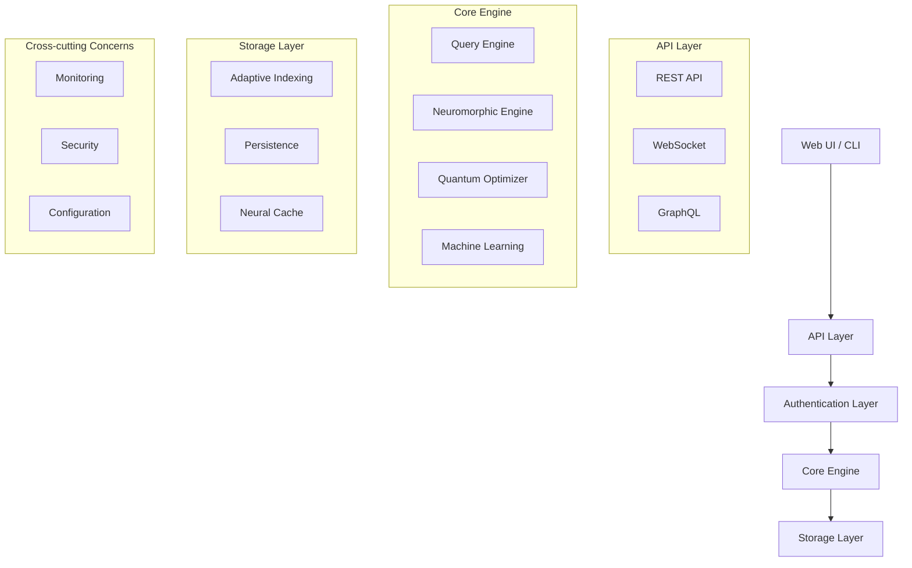
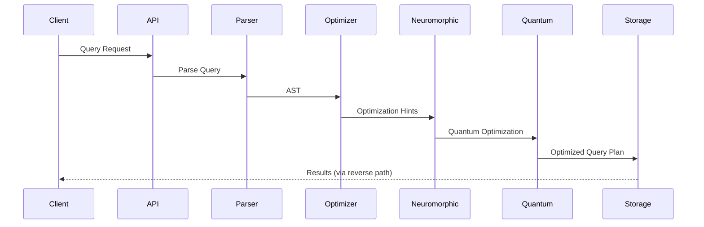

# Architektur Übersicht

NeuroQuantumDB ist als modulare, layered Architektur konzipiert, die neuromorphe Computing-Prinzipien mit modernen Datenbank-Technologien kombiniert.

## Gesamtarchitektur



## Layer-Architektur

### 1. Presentation Layer
```rust
// API Endpoints und User Interfaces
neuroquantum-api/
├── handlers/           # HTTP Request Handler
├── websocket/         # Real-time Connections
├── middleware/        # Cross-cutting Concerns
└── ui/               # Web Interface
```

**Verantwortlichkeiten:**
- HTTP/WebSocket Request Handling
- Authentication & Authorization
- Input Validation & Serialization
- Rate Limiting & Throttling

### 2. Application Layer
```rust
// Business Logic und Orchestration
neuroquantum-qsql/
├── parser/           # Query Parsing
├── planner/          # Query Planning
├── optimizer/        # Query Optimization
├── executor/         # Query Execution
└── natural_language/ # NL Processing
```

**Verantwortlichkeiten:**
- Query Language Processing (QSQL)
- Natural Language Understanding
- Query Optimization & Planning
- Business Logic Orchestration

### 3. Domain Layer
```rust
// Core Business Domain
neuroquantum-core/
├── quantum/          # Quantum Algorithms
├── synaptic/         # Neuromorphic Computing
├── plasticity/       # Learning Algorithms
├── dna/              # Data Neural Algorithms
├── security/         # Security Core
└── monitoring/       # Observability
```

**Verantwortlichkeiten:**
- Neuromorphic Computing Logic
- Quantum Optimization Algorithms
- Synaptic Plasticity Management
- Security & Encryption
- Performance Monitoring

### 4. Infrastructure Layer
```rust
// System-level Services
infrastructure/
├── storage/          # Data Persistence
├── networking/       # Network Communication
├── metrics/          # Metrics Collection
└── config/           # Configuration Management
```

## Neuromorphic Architecture

### Synaptic Network
```rust
pub struct SynapticNetwork {
    pub neurons: HashMap<NeuronId, Neuron>,
    pub synapses: HashMap<SynapseId, Synapse>,
    pub plasticity_rules: Vec<PlasticityRule>,
}

pub struct Neuron {
    pub id: NeuronId,
    pub activation_function: ActivationFunction,
    pub threshold: f64,
    pub current_activation: f64,
}

pub struct Synapse {
    pub pre_neuron: NeuronId,
    pub post_neuron: NeuronId,
    pub weight: f64,
    pub plasticity: PlasticityType,
}
```

### Adaptive Learning System
```rust
pub trait LearningAlgorithm {
    fn update_weights(&mut self, input: &QueryPattern) -> Result<(), LearningError>;
    fn predict_performance(&self, query: &Query) -> PerformancePrediction;
    fn adapt_to_workload(&mut self, workload: &WorkloadPattern);
}

impl LearningAlgorithm for HebbianLearning {
    fn update_weights(&mut self, input: &QueryPattern) -> Result<(), LearningError> {
        // Hebbian Rule: "Neurons that fire together, wire together"
        for synapse in &mut self.synapses {
            if synapse.is_active(input) {
                synapse.weight += self.learning_rate * synapse.activation_product();
            }
        }
        Ok(())
    }
}
```

## Quantum Computing Integration

### Quantum Processor
```rust
pub struct QuantumProcessor {
    pub qubits: Vec<Qubit>,
    pub quantum_gates: Vec<QuantumGate>,
    pub optimization_level: OptimizationLevel,
}

impl QuantumProcessor {
    pub async fn optimize_query(&self, query: &Query) -> Result<OptimizedQuery, QuantumError> {
        // Quantum optimization using superposition and entanglement
        let quantum_state = self.prepare_superposition(query)?;
        let optimized_state = self.apply_quantum_gates(quantum_state)?;
        let result = self.measure_quantum_state(optimized_state)?;
        Ok(result.into())
    }
}
```

### NEON Acceleration
```rust
#[cfg(target_arch = "aarch64")]
mod neon_optimizations {
    use std::arch::aarch64::*;
    
    pub unsafe fn vectorized_distance_calculation(
        vector_a: &[f32],
        vector_b: &[f32]
    ) -> f32 {
        // NEON-optimized vector operations for ARM64
        let mut sum = vdupq_n_f32(0.0);
        
        for chunk in vector_a.chunks_exact(4).zip(vector_b.chunks_exact(4)) {
            let a = vld1q_f32(chunk.0.as_ptr());
            let b = vld1q_f32(chunk.1.as_ptr());
            let diff = vsubq_f32(a, b);
            let squared = vmulq_f32(diff, diff);
            sum = vaddq_f32(sum, squared);
        }
        
        // Horizontal sum
        vaddvq_f32(sum)
    }
}
```

## Data Flow Architecture

### Query Processing Pipeline


### Neuroplasticity Feedback Loop
```rust
pub struct PlasticityFeedbackLoop {
    query_analyzer: QueryAnalyzer,
    performance_monitor: PerformanceMonitor,
    weight_updater: WeightUpdater,
    adaptation_engine: AdaptationEngine,
}

impl PlasticityFeedbackLoop {
    pub async fn process_query_result(&mut self, 
        query: &Query, 
        result: &QueryResult,
        performance: &PerformanceMetrics
    ) -> Result<(), PlasticityError> {
        // Analyze query patterns
        let pattern = self.query_analyzer.analyze(query)?;
        
        // Monitor performance impact
        let impact = self.performance_monitor.assess(performance)?;
        
        // Update synaptic weights based on feedback
        self.weight_updater.update_weights(&pattern, &impact)?;
        
        // Adapt system behavior
        self.adaptation_engine.adapt(&pattern, &impact)?;
        
        Ok(())
    }
}
```

## Concurrency Model

### Actor-based Architecture
```rust
use tokio::sync::mpsc;

pub struct DatabaseActor {
    receiver: mpsc::Receiver<DatabaseMessage>,
    state: DatabaseState,
    neuromorphic_engine: NeuromorphicEngine,
}

pub enum DatabaseMessage {
    Query { query: Query, response: oneshot::Sender<QueryResult> },
    Update { update: Update, response: oneshot::Sender<UpdateResult> },
    Learn { pattern: QueryPattern },
    Adapt { feedback: PerformanceFeedback },
}

impl DatabaseActor {
    pub async fn run(&mut self) {
        while let Some(message) = self.receiver.recv().await {
            match message {
                DatabaseMessage::Query { query, response } => {
                    let result = self.process_query(query).await;
                    let _ = response.send(result);
                }
                DatabaseMessage::Learn { pattern } => {
                    self.neuromorphic_engine.learn(pattern).await;
                }
                // Handle other messages...
            }
        }
    }
}
```

### Async/Await Pattern
```rust
pub async fn execute_neuromorphic_query(
    query: Query,
    engine: &NeuromorphicEngine
) -> Result<QueryResult, QueryError> {
    // Parallel processing with async/await
    let (parsing_task, optimization_task, learning_task) = tokio::join!(
        parse_query_async(&query),
        optimize_query_async(&query, engine),
        update_neural_weights_async(&query, engine)
    );
    
    let parsed_query = parsing_task?;
    let optimized_plan = optimization_task?;
    learning_task?;  // Fire and forget learning
    
    execute_query_plan(optimized_plan).await
}
```

## Error Handling Architecture

### Hierarchical Error Model
```rust
#[derive(Debug, thiserror::Error)]
pub enum NeuroQuantumError {
    #[error("Neuromorphic processing error: {0}")]
    Neuromorphic(#[from] NeuromorphicError),
    
    #[error("Quantum optimization error: {0}")]
    Quantum(#[from] QuantumError),
    
    #[error("Query processing error: {0}")]
    Query(#[from] QueryError),
    
    #[error("Storage error: {0}")]
    Storage(#[from] StorageError),
    
    #[error("Security error: {0}")]
    Security(#[from] SecurityError),
}

pub trait ErrorRecovery {
    async fn recover_from_error(&mut self, error: &NeuroQuantumError) -> RecoveryResult;
    fn can_recover(&self, error: &NeuroQuantumError) -> bool;
}
```

## Security Architecture

### Zero-Trust Model
```rust
pub struct SecurityContext {
    pub identity: Identity,
    pub permissions: PermissionSet,
    pub encryption_keys: EncryptionKeySet,
    pub quantum_signature: QuantumSignature,
}

pub trait SecurityGateway {
    async fn authenticate(&self, credentials: &Credentials) -> Result<Identity, AuthError>;
    async fn authorize(&self, identity: &Identity, resource: &Resource) -> Result<(), AuthzError>;
    async fn encrypt_data(&self, data: &[u8], context: &SecurityContext) -> Result<Vec<u8>, EncryptionError>;
    async fn audit_access(&self, access: &AccessEvent) -> Result<(), AuditError>;
}
```

### Quantum-Resistant Cryptography
```rust
pub struct QuantumCryptography {
    pub lattice_keys: LatticeBasedKeys,
    pub hash_signature: HashBasedSignature,
    pub code_encryption: CodeBasedEncryption,
}

impl QuantumCryptography {
    pub fn generate_quantum_resistant_key(&self) -> QuantumResistantKey {
        // Implementation using post-quantum cryptography
    }
}
```

## Monitoring Architecture

### Observability Stack
```rust
pub struct ObservabilityStack {
    pub metrics: MetricsCollector,
    pub tracing: TracingSystem,
    pub logging: StructuredLogging,
    pub health_checks: HealthCheckSystem,
}

pub struct NeuromorphicMetrics {
    pub synaptic_strength: Histogram,
    pub plasticity_rate: Gauge,
    pub learning_accuracy: Counter,
    pub quantum_coherence: Gauge,
}
```

## Deployment Architecture

### Container Strategy
```dockerfile
# Multi-stage build for optimal ARM64 performance
FROM rust:1.70-slim as builder
WORKDIR /app
COPY . .
RUN cargo build --release --target aarch64-unknown-linux-gnu

FROM debian:bookworm-slim
RUN apt-get update && apt-get install -y \
    ca-certificates \
    && rm -rf /var/lib/apt/lists/*
COPY --from=builder /app/target/aarch64-unknown-linux-gnu/release/neuroquantum-api /usr/local/bin/
EXPOSE 8080
CMD ["neuroquantum-api"]
```

### Kubernetes Deployment
```yaml
apiVersion: apps/v1
kind: Deployment
metadata:
  name: neuroquantumdb
spec:
  replicas: 3
  selector:
    matchLabels:
      app: neuroquantumdb
  template:
    metadata:
      labels:
        app: neuroquantumdb
    spec:
      containers:
      - name: neuroquantumdb
        image: ghcr.io/neuroquantumdb/neuroquantumdb:latest
        resources:
          requests:
            memory: "512Mi"
            cpu: "500m"
          limits:
            memory: "2Gi"
            cpu: "2000m"
        env:
        - name: RUST_LOG
          value: "info"
        - name: NEUROMORPHIC_ENABLED
          value: "true"
        - name: QUANTUM_OPTIMIZATION
          value: "high"
```

Diese Architektur ermöglicht es NeuroQuantumDB, die Vorteile von neuromorphem Computing und Quantum-Optimierungen voll auszuschöpfen, während gleichzeitig Skalierbarkeit, Sicherheit und Wartbarkeit gewährleistet werden.
